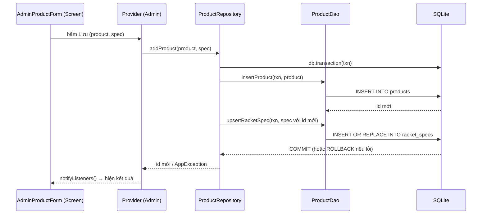

# 01 — Ghi sản phẩm cho khu Admin (thêm / sửa / xóa / ngừng bán)

> Người viết: Trọng · Ngày: 10/10/2026 · Nhánh: `feat/product-dao-write`
> Số dòng trong các link lấy tại thời điểm viết; nếu lệch, tìm theo **tên hàm** ghi cạnh link.

## 1. Tóm tắt

Phần này thêm khả năng **ghi** dữ liệu sản phẩm vào SQLite: thêm sản phẩm mới, sửa sản phẩm (kèm thông số vợt `racket_specs`), và xóa sản phẩm — xóa thật nếu chưa ai mua, còn đã có trong đơn hàng thì chỉ **ngừng bán**. Code nằm ở tầng DAO và Repository; màn hình Admin quản lý sản phẩm (form thêm/sửa, nút xóa, nút Undo) và Provider tương ứng sẽ gọi vào đây ở lượt sau.

## 2. Sơ đồ luồng

Ví dụ thao tác "Admin bấm Lưu khi thêm một cây vợt":



Luồng "Xóa sản phẩm":

```text
Screen ──bấm Xóa──► Provider ──► ProductRepository.countOrdersOfProduct(id)   → hiện dialog "Có N đơn..."
                         │
                         └──xác nhận──► ProductRepository.deleteProduct(id)
                                           └─ db.transaction:
                                                ProductDao.countOrderItems(txn, id)
                                                  = 0 → ProductDao.deleteProduct(txn, id)   → DELETE (cascade)
                                                  > 0 → ProductDao.setActive(txn, id, false) → UPDATE is_active = 0
                                           ◄── ProductDeleteOutcome.deleted / .deactivated
Screen ◄── SnackBar "Đã ngừng bán" + nút Undo ──► ProductRepository.restoreProduct(id)
```

## 3. Các file đã thay đổi

| File | Thêm gì | Vì sao |
| ---- | ------- | ------ |
| [lib/data/daos/product_dao.dart](../../lib/data/daos/product_dao.dart#L97) | Khối `// ===== WRITE (Trọng) =====` với 8 hàm ghi/đếm + 1 helper private; thêm import `db_time.dart`, `racket_spec.dart` | DAO là nơi **duy nhất** được chạy SQL. Mỗi hàm một câu SQL, không có logic nghiệp vụ |
| [lib/data/repositories/product_repository.dart](../../lib/data/repositories/product_repository.dart#L69) | 5 hàm public + 1 helper private; import `debugPrint`, `enums.dart`, `racket_spec.dart` | Repository ghép nhiều lệnh DAO thành một nghiệp vụ, bọc trong transaction, đổi lỗi DB thành `AppException` tiếng Việt |
| [lib/core/constants/enums.dart](../../lib/core/constants/enums.dart#L20) | `enum ProductDeleteOutcome { deleted, deactivated }` | Cho UI biết thao tác xóa đã thực sự làm gì để hiện thông báo đúng |
| [test/product_repository_write_test.dart](../../test/product_repository_write_test.dart#L12) | File test mới, 6 ca | Chứng minh transaction, cascade và soft delete chạy đúng trên SQLite thật (in-memory) |

Không sửa schema, model, provider hay màn hình nào.

## 4. Giải thích từng hàm

### 4.1. Tầng DAO — [ProductDao](../../lib/data/daos/product_dao.dart#L9)

Mọi hàm nhận tham số đầu là `DatabaseExecutor db`. `DatabaseExecutor` là kiểu cha của cả `Database` và `Transaction`, nên **cùng một hàm** dùng được cả ngoài lẫn trong transaction. Đây là quy ước sẵn có của nhóm (xem `UserDao`).

#### `_productValues` — [product_dao.dart#L100](../../lib/data/daos/product_dao.dart#L100)

- **Làm gì:** đổi object `Product` thành `Map` cột → giá trị để ghi xuống DB.
- **Nhận / trả:** `Product` → `Map<String, Object?>`.
- **Ai gọi:** `insertProduct`, `updateProduct`.
- Model `Product` của Kha chỉ có `fromMap`, không có `toMap`, nên DAO tự dựng map (giống `UserDao.insert`). Map **không có `id`** để SQLite tự cấp id khi insert; `bool` được đổi thành `0/1`.

```dart
      'is_featured': product.isFeatured ? 1 : 0,
      'is_active': product.isActive ? 1 : 0,
```

#### `insertProduct` — [product_dao.dart#L119](../../lib/data/daos/product_dao.dart#L119)

- **Làm gì:** `INSERT INTO products`.
- **Nhận / trả:** `(db, Product)` → `Future<int>` là **id mới** do SQLite cấp (`AUTOINCREMENT`).
- **Ai gọi:** `ProductRepository.addProduct`.

```dart
  Future<int> insertProduct(DatabaseExecutor db, Product product) {
    return db.insert(DbSchema.products, _productValues(product));
  }
```

#### `updateProduct` — [product_dao.dart#L124](../../lib/data/daos/product_dao.dart#L124)

- **Làm gì:** `UPDATE products ... WHERE id = ?`, đồng thời cập nhật `updated_at`.
- **Nhận / trả:** `(db, Product)` → số dòng bị ảnh hưởng (0 nghĩa là không có id đó).
- **Ai gọi:** `ProductRepository.updateProduct`.

```dart
      {..._productValues(product), 'updated_at': dbTime(DateTime.now())},
      where: 'id = ?',
      whereArgs: [product.id],
```

`dbTime` ([db_time.dart#L2](../../lib/core/utils/db_time.dart#L2)) là hàm có sẵn của nhóm, trả chuỗi UTC dạng `YYYY-MM-DD HH:MM:SS` — cùng định dạng với `CURRENT_TIMESTAMP` trong schema.

#### `upsertRacketSpec` — [product_dao.dart#L133](../../lib/data/daos/product_dao.dart#L133)

- **Làm gì:** ghi thông số vợt; nếu `product_id` đã có dòng thì **thay** dòng cũ (upsert = update + insert).
- **Nhận / trả:** `(db, RacketSpec)` → rowid.
- **Ai gọi:** `addProduct`, `updateProduct` ở repository.

```dart
    }, conflictAlgorithm: ConflictAlgorithm.replace);
```

`product_id` là PRIMARY KEY của `racket_specs` ([db_schema.dart#L83](../../lib/core/database/db_schema.dart#L83)), nên mỗi sản phẩm có tối đa một dòng spec.

#### `deleteRacketSpec` — [product_dao.dart#L145](../../lib/data/daos/product_dao.dart#L145)

- **Làm gì:** `DELETE FROM racket_specs WHERE product_id = ?`.
- **Nhận / trả:** `(db, productId)` → số dòng đã xóa (0 nếu sản phẩm vốn không có spec — không phải lỗi).
- **Ai gọi:** `ProductRepository.updateProduct` khi `spec == null`.

#### `countOrderItems` — [product_dao.dart#L153](../../lib/data/daos/product_dao.dart#L153)

- **Làm gì:** đếm số **dòng** `order_items` có sản phẩm này.
- **Nhận / trả:** `(db, productId)` → `int`.
- **Ai gọi:** `ProductRepository.deleteProduct` để quyết định xóa thật hay ngừng bán.

```dart
      'SELECT COUNT(*) AS count FROM ${DbSchema.orderItems} '
      'WHERE product_id = ?',
```

#### `countOrdersOfProduct` — [product_dao.dart#L162](../../lib/data/daos/product_dao.dart#L162)

- **Làm gì:** đếm số **đơn hàng khác nhau** có chứa sản phẩm (`COUNT(DISTINCT order_id)`).
- **Nhận / trả:** `(db, productId)` → `int`.
- **Ai gọi:** `ProductRepository.countOrdersOfProduct` → dialog xác nhận xóa.

Khác với `countOrderItems`: một đơn có thể có 2 dòng cùng sản phẩm (khác size), `COUNT(*)` ra 2 nhưng `COUNT(DISTINCT order_id)` ra 1 — con số người dùng hiểu là "1 đơn".

#### `deleteProduct` — [product_dao.dart#L172](../../lib/data/daos/product_dao.dart#L172)

- **Làm gì:** `DELETE FROM products WHERE id = ?` — xóa thật.
- **Nhận / trả:** `(db, productId)` → số dòng đã xóa.
- **Ai gọi:** `ProductRepository.deleteProduct` khi chưa có đơn nào.

Các bảng con tự dọn theo khóa ngoại `ON DELETE CASCADE`: `racket_specs` ([db_schema.dart#L85](../../lib/core/database/db_schema.dart#L85)), `cart_items` ([#L111](../../lib/core/database/db_schema.dart#L111)), `wishlists` ([#L157](../../lib/core/database/db_schema.dart#L157)). Điều này chỉ chạy vì [DatabaseHelper.onConfigure](../../lib/core/database/database_helper.dart#L55) đã bật `PRAGMA foreign_keys = ON` (SQLite mặc định **tắt** khóa ngoại).

#### `setActive` — [product_dao.dart#L180](../../lib/data/daos/product_dao.dart#L180)

- **Làm gì:** cập nhật `is_active` (0/1) và `updated_at`.
- **Nhận / trả:** `(db, productId, bool isActive)` → số dòng bị ảnh hưởng.
- **Ai gọi:** `deleteProduct` (ngừng bán) và `restoreProduct` (bán lại) ở repository.

```dart
      {'is_active': isActive ? 1 : 0, 'updated_at': dbTime(DateTime.now())},
```

### 4.2. Tầng Repository — [ProductRepository](../../lib/data/repositories/product_repository.dart#L11)

Repository nhận `Future<Database> Function() database` qua constructor (để test truyền DB in-memory vào được), gọi DAO, và **không** chứa câu SQL nào. Mọi hàm đều theo một khuôn xử lý lỗi giống `AuthRepository`:

```dart
    } on DatabaseException catch (error) {
      debugPrint('ProductRepository.addProduct: $error');
      throw const AppException(
        'Không thể thêm sản phẩm. Vui lòng kiểm tra lại thông tin.',
      );
    }
```

→ Lỗi kỹ thuật được in ra console cho dev; UI chỉ nhận câu tiếng Việt thân thiện qua `AppException.message`.

#### `addProduct` — [product_repository.dart#L73](../../lib/data/repositories/product_repository.dart#L73)

- **Làm gì:** thêm sản phẩm mới; nếu có `spec` thì ghi luôn thông số vợt, **trong cùng một transaction**.
- **Nhận:** `Product product` (trường `id` bị bỏ qua, truyền `0` cũng được), `RacketSpec? spec` (null nếu không phải vợt).
- **Trả:** `Future<int>` — id mới.
- **Ai gọi:** Provider của form Admin khi bấm Lưu ở chế độ thêm mới.

```dart
      return await db.transaction((txn) async {
        final productId = await _productDao.insertProduct(txn, product);
        if (spec != null) {
          await _productDao.upsertRacketSpec(
            txn,
            _specForProduct(spec, productId),
          );
        }
        return productId;
      });
```

Lưu ý mọi lệnh bên trong dùng `txn`, **không** dùng `db` — dùng `db` trong transaction sẽ bị treo (deadlock) vì SQLite đang khóa cho `txn`.

#### `updateProduct` — [product_repository.dart#L96](../../lib/data/repositories/product_repository.dart#L96)

- **Làm gì:** sửa sản phẩm theo `product.id`; có `spec` thì upsert, không có thì xóa spec cũ.
- **Nhận:** `Product product` (phải có id thật), `RacketSpec? spec`.
- **Trả:** `Future<void>`; ném `AppException('Không tìm thấy sản phẩm cần sửa.')` nếu id không tồn tại.
- **Ai gọi:** Provider của form Admin ở chế độ sửa.

```dart
        if (spec != null) {
          await _productDao.upsertRacketSpec(
            txn,
            _specForProduct(spec, product.id),
          );
        } else {
          await _productDao.deleteRacketSpec(txn, product.id);
        }
```

Nhờ nhánh `else`, khi admin đổi một cây vợt sang danh mục khác (form không gửi spec), dòng `racket_specs` cũ bị xóa — không để lại dữ liệu "mồ côi".

#### `countOrdersOfProduct` — [product_repository.dart#L122](../../lib/data/repositories/product_repository.dart#L122)

- **Làm gì:** trả số đơn hàng có chứa sản phẩm.
- **Nhận / trả:** `int productId` → `Future<int>`.
- **Ai gọi:** màn hình/Provider trước khi mở dialog xác nhận xóa, để hiện "Sản phẩm này nằm trong N đơn hàng, sẽ chuyển sang ngừng bán".

#### `deleteProduct` — [product_repository.dart#L134](../../lib/data/repositories/product_repository.dart#L134)

- **Làm gì:** trong một transaction: đếm `order_items`; = 0 thì xóa thật, > 0 thì ngừng bán.
- **Nhận / trả:** `int productId` → `Future<ProductDeleteOutcome>`.
- **Ai gọi:** Provider khi admin xác nhận xóa.

```dart
        final affected = orderItemCount == 0
            ? await _productDao.deleteProduct(txn, productId)
            : await _productDao.setActive(txn, productId, false);
        if (affected == 0) {
          throw const AppException('Không tìm thấy sản phẩm cần xóa.');
        }
        return orderItemCount == 0
            ? ProductDeleteOutcome.deleted
            : ProductDeleteOutcome.deactivated;
```

#### `restoreProduct` — [product_repository.dart#L159](../../lib/data/repositories/product_repository.dart#L159)

- **Làm gì:** đặt lại `is_active = 1`.
- **Nhận / trả:** `int productId` → `Future<void>`.
- **Ai gọi:** nút **Undo** trên SnackBar sau khi sản phẩm bị chuyển sang ngừng bán.

Chỉ một lệnh ghi một bảng nên không cần transaction.

#### `_specForProduct` — [product_repository.dart#L172](../../lib/data/repositories/product_repository.dart#L172)

- **Làm gì:** tạo lại `RacketSpec` với `productId` đúng.
- **Vì sao cần:** khi thêm mới, form chưa biết id sản phẩm (phải insert xong mới có). `RacketSpec` không có `copyWith` và các trường là `final`, nên tạo object mới.

### 4.3. Enum — [ProductDeleteOutcome](../../lib/core/constants/enums.dart#L20)

```dart
enum ProductDeleteOutcome { deleted, deactivated }
```

Dùng enum thay vì `bool` để code ở UI đọc rõ nghĩa (`outcome == ProductDeleteOutcome.deactivated`) và dễ thêm trường hợp mới sau này.

## 5. Vì sao làm như vậy

**Vì sao dùng transaction?**
"Thêm một cây vợt là ghi vào hai bảng: `products` và `racket_specs`. Nếu bảng thứ hai lỗi mà bảng thứ nhất đã ghi rồi, ta có một cây vợt không có thông số — dữ liệu hỏng. Transaction đảm bảo **tất cả hoặc không gì cả**: lỗi ở bất kỳ bước nào thì SQLite rollback toàn bộ. Ca test số 4 chứng minh điều này."

**Vì sao tách `addProduct` và `updateProduct` thay vì một hàm `saveProduct`?**
"Model `Product` có `id` kiểu `int` bắt buộc, không thể null, nên không có cách sạch để biết 'đây là sản phẩm mới hay cũ'. Thay vì quy ước kiểu `id = 0` là mới — dễ nhầm — em tách hai hàm. Form biết rõ mình đang ở chế độ thêm hay sửa, nên gọi đúng hàm. Mỗi hàm làm một việc, dễ đọc, dễ test."

**Vì sao có cả xóa thật và ngừng bán?**
"Bảng `order_items` giữ tham chiếu tới sản phẩm. Nếu xóa thật một sản phẩm đã bán, lịch sử đơn hàng của khách sẽ mất liên kết tới sản phẩm (cột `product_id` bị `SET NULL`). Nên: sản phẩm chưa ai mua thì xóa thật cho gọn database; đã có trong đơn thì chỉ đặt `is_active = 0` — gọi là soft delete. Các hàm đọc ở trang chủ đều lọc `is_active = 1`, nên khách không thấy sản phẩm đó nữa, nhưng đơn cũ vẫn nguyên vẹn."

**Vì sao repository không tự kiểm tra danh mục có phải Rackets?**
"Trong app chưa có cách nào biết danh mục nào là vợt ngoài việc so tên hoặc cứng id — cả hai đều dễ vỡ. Nên em để form quyết định: form vợt gửi `spec`, form khác gửi `null`. Repository chỉ làm theo: có spec thì ghi, không có thì xóa. Quy tắc đơn giản, dễ test."

**Vì sao DAO nhận `DatabaseExecutor` thay vì tự lấy database?**
"Để cùng một hàm DAO chạy được cả bên trong transaction (truyền `txn`) lẫn bên ngoài (truyền `db`). Nếu DAO tự gọi `DatabaseHelper.instance.database` thì không thể gộp nhiều lệnh vào chung một transaction."

**Vì sao `countOrderItems` và `countOrdersOfProduct` là hai hàm?**
"Mục đích khác nhau. Quyết định xóa chỉ cần biết 'có hay không' nên đếm dòng là đủ. Còn con số hiển thị cho admin phải là số đơn thật, nên dùng `COUNT(DISTINCT order_id)`."

**Vì sao repository bắt `DatabaseException` rồi ném `AppException`?**
"Màn hình không nên hiểu lỗi SQLite như `CHECK constraint failed`. Repository dịch nó thành câu tiếng Việt, còn lỗi gốc vẫn in qua `debugPrint` để dev sửa. UI chỉ cần `catch AppException` và hiện `e.message`."

## 6. Cách dùng

> Đoạn dưới là **ví dụ minh họa** — repo chưa có Provider/màn hình Admin sản phẩm. Viết theo khuôn [HomeProvider](../../lib/providers/home_provider.dart#L9).

Khởi tạo repository (giống cách [app_routes.dart](../../lib/routes/app_routes.dart#L89) đang tạo cho Home):

```dart
ProductRepository(
  database: () => DatabaseHelper.instance.database,
  productDao: const ProductDao(),
)
```

Trong Provider:

```dart
// Lưu ý: import 'package:flutter/foundation.dart' hide Category;
// vì foundation cũng có class tên Category.

Future<bool> save(Product product, RacketSpec? spec, {required bool isEdit}) async {
  try {
    if (isEdit) {
      await _repository.updateProduct(product, spec);
    } else {
      await _repository.addProduct(product, spec);
    }
    return true;
  } on AppException catch (e) {
    _errorMessage = e.message;
    notifyListeners();
    return false;
  }
}

Future<ProductDeleteOutcome?> delete(int productId) async {
  try {
    return await _repository.deleteProduct(productId);
  } on AppException catch (e) {
    _errorMessage = e.message;
    notifyListeners();
    return null;
  }
}
```

Trên màn hình, sau khi xác nhận xóa:

```dart
final orders = await repository.countOrdersOfProduct(product.id); // dùng cho nội dung dialog
// ... admin bấm "Xóa" ...
final outcome = await provider.delete(product.id);
if (outcome == ProductDeleteOutcome.deactivated) {
  // SnackBar "Đã chuyển sang ngừng bán" + action Undo → provider gọi restoreProduct(product.id)
} else if (outcome == ProductDeleteOutcome.deleted) {
  // SnackBar "Đã xóa sản phẩm" (không có Undo vì dữ liệu đã mất hẳn)
}
```

Khi thêm vợt mới, `RacketSpec.productId` truyền tạm `0` — repository sẽ thay bằng id thật.

## 7. Cách test

### Chạy test tự động

```bash
flutter test test/product_repository_write_test.dart
```

Test mở một DB SQLite **in-memory** qua `sqflite_common_ffi`, chạy đúng `onConfigure` + `onCreate` thật (tạo bảng + seed), nên kết quả phản ánh đúng schema và khóa ngoại thật. Mỗi ca có DB mới, không ảnh hưởng nhau.

| # | Ca test | Chứng minh điều gì |
| - | ------- | ------------------ |
| 1 | [thêm vợt ghi cả products và racket_specs](../../test/product_repository_write_test.dart#L41) | `addProduct` ghi được hai bảng và spec gắn đúng id mới |
| 2 | [thêm giày không tạo dòng racket_specs](../../test/product_repository_write_test.dart#L56) | `spec == null` thì không ghi spec |
| 3 | [sửa vợt sang danh mục khác thì xóa racket_specs](../../test/product_repository_write_test.dart#L66) | `updateProduct` sửa được cột và dọn spec cũ |
| 4 | [spec vi phạm CHECK thì rollback](../../test/product_repository_write_test.dart#L87) | `weight_class = '9U'` vi phạm CHECK → ném `AppException`, và `products` **không** tăng dòng → transaction rollback thật |
| 5 | [xóa sản phẩm chưa có trong đơn thì mất hẳn](../../test/product_repository_write_test.dart#L101) | Trả `deleted`, mất dòng `products`, và `racket_specs` tự xóa theo cascade |
| 6 | [xóa sản phẩm đã có trong đơn thì ngừng bán, restore bán lại](../../test/product_repository_write_test.dart#L114) | Trả `deactivated`, `is_active = 0`; `restoreProduct` đưa về `1`; `countOrdersOfProduct > 0` |

Kết quả lúc viết: tất cả pass; `flutter analyze` không có error/warning từ code mới.

### Test tay trên app

Chưa có màn Admin, nên test tay hiện chỉ làm được khi màn hình/Provider đã có. Khi có, làm theo các bước:

1. Đăng nhập tài khoản ADMIN, vào quản lý sản phẩm.
2. Thêm một cây vợt có đủ thông số → mở lại sản phẩm, thông số vẫn còn.
3. Thêm một đôi giày → lưu thành công, không có phần thông số vợt.
4. Sửa cây vợt vừa thêm sang danh mục Shoes → lưu, mở lại không còn thông số vợt.
5. Xóa sản phẩm vừa thêm (chưa ai mua) → báo "Đã xóa", biến mất khỏi danh sách.
6. Xóa **Yonex Astrox 77 Pro** (có trong đơn mẫu) → dialog báo có đơn, sau khi xác nhận báo "Đã ngừng bán", sản phẩm biến mất khỏi trang chủ; bấm **Undo** → xuất hiện lại.
7. Vào My Orders của customer → đơn cũ chứa Astrox 77 Pro vẫn hiển thị bình thường.

Có thể kiểm tra DB bằng màn debug [db_check_screen.dart](../../lib/core/database/db_check_screen.dart) hoặc nút "Reset demo data" để làm lại từ đầu.

## 8. Câu hỏi vấn đáp có thể gặp

**H: Nếu bỏ transaction thì chuyện gì xảy ra ở ca test số 4?**
Đ: Dòng `products` đã được insert trước khi insert `racket_specs` lỗi, nên sẽ còn lại một cây vợt không có thông số. Test sẽ fail vì số dòng `products` tăng lên 1.

**H: Tại sao bên trong `db.transaction` phải dùng `txn` mà không dùng `db`?**
Đ: Transaction giữ khóa trên kết nối; gọi `db` trong lúc đó sẽ phải chờ transaction xong, mà transaction lại đang chờ lệnh đó → treo. sqflite cũng cảnh báo điều này. Vì vậy DAO nhận `DatabaseExecutor` để truyền `txn` vào.

**H: Xóa thật một sản phẩm thì giỏ hàng và wishlist của khách có bị lỗi không?**
Đ: Không. `cart_items` và `wishlists` khai báo `ON DELETE CASCADE` tới `products`, nên SQLite tự xóa các dòng đó. Điều kiện là `PRAGMA foreign_keys = ON`, đã bật trong `DatabaseHelper.onConfigure`.

**H: Ngừng bán rồi thì sản phẩm còn hiện ở đâu?**
Đ: Các hàm đọc phía khách (`getFeaturedProducts`, `getTrendingProducts`, `getTopBrands`, `getHeroProduct`) đều lọc `is_active = 1` nên không hiện. Đơn hàng cũ vẫn hiện vì `order_items` lưu sẵn `product_name`, `product_image`, `unit_price` tại thời điểm mua.

**H: `ConflictAlgorithm.replace` hoạt động thế nào? Có nguy hiểm không?**
Đ: Khi trùng khóa chính `product_id`, SQLite xóa dòng cũ rồi chèn dòng mới. Với `racket_specs` là an toàn vì không bảng nào tham chiếu tới nó. Nếu bảng có bảng con trỏ tới thì REPLACE có thể kích hoạt cascade ngoài ý muốn — khi đó nên dùng UPDATE.

**H: Tại sao không đặt câu SQL thẳng trong Repository cho nhanh?**
Đ: Theo kiến trúc của nhóm, chỉ DAO được chạy SQL. Repository lo nghiệp vụ (khi nào xóa thật, khi nào ngừng bán, lỗi gì báo câu gì). Tách như vậy thì đổi SQL không ảnh hưởng nghiệp vụ, và test nghiệp vụ dễ đọc hơn.

## 9. Lưu ý và việc còn dang dở

**Giả định / hạn chế**
- `updateProduct` ghi lại **mọi cột** từ object `Product`, kể cả `rating`, `rating_count`, `is_active`. Form nên lấy bản mới nhất (`findById`) trước khi sửa, nếu không có thể ghi đè giá trị cũ.
- `updated_at` dùng `dbTime()` — dạng `YYYY-MM-DD HH:MM:SS` UTC (ISO-8601 với dấu cách thay cho `T`), khớp với dữ liệu seed.
- Khi thêm mới phải truyền `Product.id` và `RacketSpec.productId` giả (ví dụ `0`) vì model bắt buộc có id; giá trị này bị bỏ qua.
- Việc có gửi `spec` hay không hoàn toàn do form quyết định; repository không kiểm tra danh mục.
- Repository chưa validate dữ liệu đầu vào (tên rỗng, giá âm...). Giá `<= 0` sẽ bị CHECK của DB chặn và báo lỗi chung; nên validate ở form/Provider để báo lỗi cụ thể theo field.

**Cần nhắn Kha (owner `product_dao.dart`, models)**
- Cân nhắc đổi `Product.id` sang `int?` cho sản phẩm chưa lưu.
- `Product`, `RacketSpec` chưa có `toMap`/`copyWith`.
- [findById](../../lib/data/daos/product_dao.dart#L84) không lọc `is_active` — admin cần vậy, nhưng màn chi tiết phía khách nên tự kiểm tra `isActive`.
- 2 `info` `prefer_initializing_formals` ở constructor `ProductRepository` (code có sẵn).

**Cần nhắn Hào (owner schema/database)**
- (Tùy chọn) thêm hằng nhận diện danh mục vợt nếu sau này cần.
- `sqflite_common_ffi` đang nằm ở `dependencies`; nếu chỉ dùng cho test nên chuyển sang `dev_dependencies`.

**Việc tiếp theo**
- Provider Admin cho sản phẩm + màn hình form thêm/sửa, dialog xóa, SnackBar Undo.
- Hàm đọc danh sách sản phẩm cho Admin (gồm cả sản phẩm ngừng bán).
